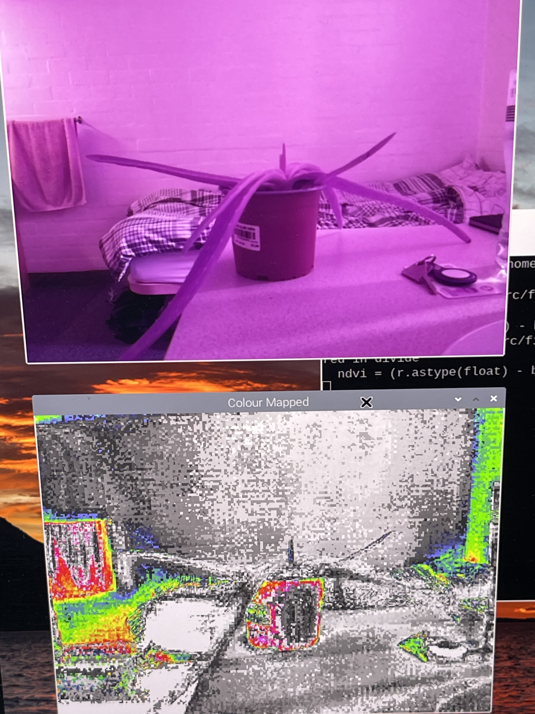
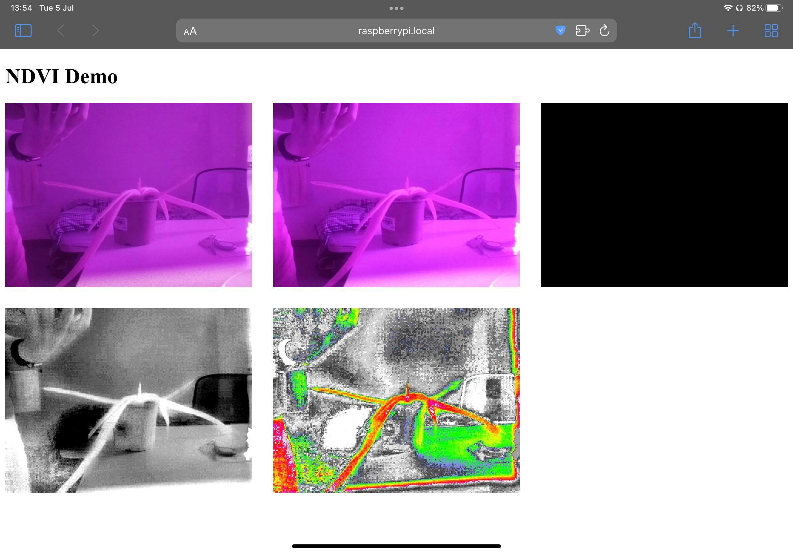

# Raspberry Pi NDVI

Uses the Raspberry Pi NoIR infrared camera to measure the NDVI (Normalised Difference Vegetation Index) of plants visualise their health.

<div style="display:flex; gap:6px;">
    
    
</div>

## Background
Plants use photosynthesis to convert sunlight, water, and carbon dioxide into sugar, which is used for its energy.

Chlorophyll, the pigment used for photosynthesis, only uses some of the electromagnetic spectrum from the sun. Most noticably, green visible light is not used, so is reflected away—this is why we see plants as mostly green. Likewise, chlorophyll reflects away infrared light.

The amount of IR light reflected by a plant can indicate how healthy it is; healthy plants reflect a lot of near-inrared light whereas dying plants absorb a lot of IR.

### Calculating NDVI

Blue pixels are made bright and red pixels are made darker to create a black & white image. Bright pixels are healthy plants and dark are unhealthy, or no plants.

To make this more visible, a colour map is applied to the black and white image. Whiter, thus healthier, areas become red, and darker areas become more blue.

## Hardware Setup

The *Raspberry Pi NoIR Camera v2* should be connected to the camera port on the Raspberry Pi.

The raspberry Pi should be running Raspbian or any Linux operating system which can run Python 3.7+.

## Building & Running
1. Clone the repository

    ```git clone https://github.com/benbrackenbury/RPi-NDVI.git ```

2. Setup the virtual environment

    ```virtualenv env```

    ```source env/bin/activate```

3. Install dependencies

    ```pip3 install -Ur requirements.txt```

4. Run a script

    There are 2 scripts in this project: 
    * one for showing previews of eahc step in graphical windows (requires the RPi is connected to a display and booted into a desktop environment)
    * another for running a web server showing each step which can be accessed by any device on the same network as the Rpi.

    <br>

    4a. Preview (windows)

    ```make preiew```

    This will show only the original unmodified camera feed and the final colour-mapped result by default. To show every step, run
    
    ```python3 src/preview.py --all```.

    <br/>
    4b. Web View

    ```make preview```

    or

    ```python3 src/webview.py```

    The web server can be accessed from the RPi at ```http://127.0.0.1:3000``` or on another device on the same netwrok at ```http://<RPI IP ADDRESS>:3000```. Apple devices support accessing the RPi via its hostname ```http://raspberrypi.local:3000```.


## 3rd Party Libraries & Code
* OpenCV, Flask, NumPy
* Scripts in the src/lib directory have been originally created by a third party.
    * [Fastiecm colour mapping]("https://projects-static.raspberrypi.org/projects/astropi-ndvi/2cc9d1033d9c4f05388632e7912a4bb5531b3d94/en/images/fastiecm.py")

    * [Script for asynchronously accessing the most recent frame captured by the camera]("https://gist.github.com/crackwitz/15c3910f243a42dcd9d4a40fcdb24e40")

        * Partially modified to work with this existsing application.